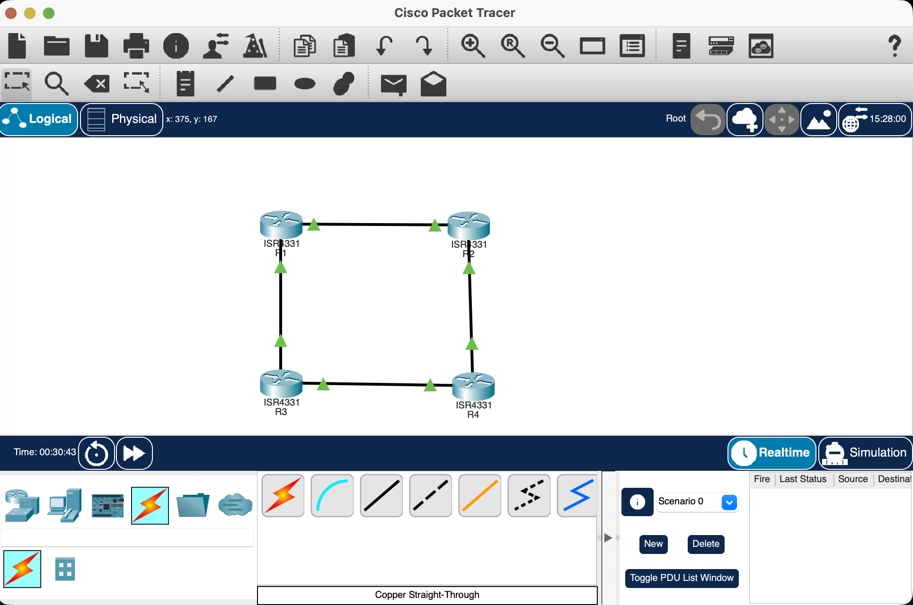

# Static Routing with Failover Using Floating Static Routes

---

## Project Overview

This project demonstrates **IPv4 Static Routing with Failover using Floating Static Routes** in Cisco Packet Tracer.

A four-router redundant topology was created using **R1, R2, R3, and R4**. The network provides two paths between the source network behind R1 and the destination network behind R4.

The **primary path** is:

```text
R1 → R2 → R4
```

The **backup path** is:

```text
R1 → R3 → R4
```

A normal static route with **Administrative Distance (AD) 1** was configured for the primary path, while a floating static route with **AD 10** was configured through R3 as the backup.

The configuration, connectivity, routing paths, failover, and restoration were tested successfully in Cisco Packet Tracer.

---

## Objectives

* Create a four-router redundant network topology.
* Configure IPv4 addressing on router interfaces.
* Configure Loopback interfaces to represent the source and destination LANs.
* Configure primary static routes.
* Configure a floating static route as a backup.
* Verify routing tables using Cisco IOS commands.
* Test connectivity using `ping`.
* Verify the actual routing path using `traceroute`.
* Simulate failure of the primary link.
* Verify automatic activation of the floating static route.
* Restore the primary link.
* Verify that traffic returns to the primary path.

---

## Network Topology

The network was configured in a four-router diamond topology.

```text
                 R1 ───────── R2
                 │             │
                 │             │
                 │             │
                 R3 ───────── R4

             Primary Path: R1 → R2 → R4
             Backup Path:  R1 → R3 → R4
```

The topology provides redundancy between the source network `192.168.1.0/24` and destination network `192.168.4.0/24`.

---

## IP Addressing Scheme

| Router | Interface | IP Address  | Subnet Mask     | Connection      |
| ------ | --------- | ----------- | --------------- | --------------- |
| R1     | G0/0/0    | 10.0.12.1   | 255.255.255.252 | R1–R2 Primary   |
| R2     | G0/0/0    | 10.0.12.2   | 255.255.255.252 | R2–R1 Primary   |
| R1     | G0/0/1    | 10.0.13.1   | 255.255.255.252 | R1–R3 Backup    |
| R3     | G0/0/0    | 10.0.13.2   | 255.255.255.252 | R3–R1 Backup    |
| R2     | G0/0/1    | 10.0.24.1   | 255.255.255.252 | R2–R4 Primary   |
| R4     | G0/0/0    | 10.0.24.2   | 255.255.255.252 | R4–R2 Primary   |
| R3     | G0/0/1    | 10.0.34.1   | 255.255.255.252 | R3–R4 Backup    |
| R4     | G0/0/1    | 10.0.34.2   | 255.255.255.252 | R4–R3 Backup    |
| R1     | Loopback0 | 192.168.1.1 | 255.255.255.0   | Source LAN      |
| R4     | Loopback0 | 192.168.4.1 | 255.255.255.0   | Destination LAN |

> The Cisco 4331 routers used in my Packet Tracer project display the interfaces as `GigabitEthernet0/0/0` and `GigabitEthernet0/0/1`.

---

## Routing Design

### Primary Static Route

The primary route from R1 to the destination network `192.168.4.0/24` uses R2 as the next hop.

```text
R1 → R2 → R4
```

Primary next hop:

```text
10.0.12.2
```

Administrative Distance:

```text
1
```

The primary route is preferred because it has the lower Administrative Distance.

### Floating Static Route

A backup route was configured on R1 through R3.

```text
R1 → R3 → R4
```

Backup next hop:

```text
10.0.13.2
```

Administrative Distance:

```text
10
```

Because AD 10 is higher than the primary route's AD 1, the floating static route remains in the background during normal operation.

When the primary path becomes unavailable, the floating static route is installed automatically.

---

## Router Configuration Summary

### R1

R1 was configured with:

* Loopback0: `192.168.1.1/24`
* Link to R2: `10.0.12.1/30`
* Link to R3: `10.0.13.1/30`
* Primary route to LAN B through R2
* Floating static route to LAN B through R3

Primary route:

```text
ip route 192.168.4.0 255.255.255.0 10.0.12.2
```

Floating static route:

```text
ip route 192.168.4.0 255.255.255.0 10.0.13.2 10
```

### R2

R2 was configured as the primary transit router.

* Link to R1: `10.0.12.2/30`
* Link to R4: `10.0.24.1/30`

Routes:

```text
ip route 192.168.1.0 255.255.255.0 10.0.12.1
ip route 192.168.4.0 255.255.255.0 10.0.24.2
```

### R3

R3 was configured as the backup transit router.

* Link to R1: `10.0.13.2/30`
* Link to R4: `10.0.34.1/30`

Routes:

```text
ip route 192.168.1.0 255.255.255.0 10.0.13.1
ip route 192.168.4.0 255.255.255.0 10.0.34.2
```

### R4

R4 was configured with:

* Loopback0: `192.168.4.1/24`
* Link to R2: `10.0.24.2/30`
* Link to R3: `10.0.34.2/30`
* Primary route back to LAN A through R2
* Floating static route back to LAN A through R3

Primary route:

```text
ip route 192.168.1.0 255.255.255.0 10.0.24.1
```

Floating static route:

```text
ip route 192.168.1.0 255.255.255.0 10.0.34.1 10
```

---

## Verification

After configuring the routers, the routing tables and interfaces were verified using Cisco IOS commands.

### Interface Verification

```text
show ip interface brief
```

This was used to verify that the configured interfaces were operational and had the correct IP addresses.

### Routing Table Verification

```text
show ip route
```

The routing table was checked to confirm that the primary static route was active during normal operation.

### Static Route Verification

```text
show ip route static
```

This command was used to verify the configured static and floating static routes.

---

## Normal Operation Test

With all links operational, the primary route was active.

The routing path was:

```text
R1 → R2 → R4
```

The destination `192.168.4.1` was successfully reached from R1.

### Normal Ping

The following command was used:

```text
ping 192.168.4.1
```

The ping test was successful, confirming end-to-end connectivity.

### Normal Traceroute

The following command was used:

```text
traceroute 192.168.4.1
```

The traceroute confirmed that traffic was using the primary path through R2.

Expected path:

```text
R1
 ↓
10.0.12.2
 ↓
10.0.24.2
 ↓
R4
```

---

## Failover Test

To verify redundancy, the primary R1–R2 connection was intentionally disabled.

On R2, the interface connected to R1 was shut down:

```text
configure terminal
interface GigabitEthernet0/0/0
shutdown
end
```

This simulated a failure of the primary path.

---

## Floating Static Route Activation

After the primary link failed, the primary route through R2 was removed from the active routing table.

The floating static route through R3 became active automatically.

R1 then used:

```text
10.0.13.2
```

as the next hop.

The new path became:

```text
R1 → R3 → R4
```

The routing table showed the floating route with Administrative Distance 10.

---

## Backup Connectivity Test

After the primary link failure, connectivity was tested again using:

```text
ping 192.168.4.1
```

The destination remained reachable.

This confirmed that traffic successfully switched to the backup path.

---

## Backup Traceroute

The backup path was verified using:

```text
traceroute 192.168.4.1
```

The traceroute showed the backup path through R3.

Expected path:

```text
R1
 ↓
10.0.13.2
 ↓
10.0.34.2
 ↓
R4
```

This confirmed successful failover.

---

## Primary Link Restoration

After completing the failover test, the primary R1–R2 connection was restored.

On R2:

```text
configure terminal
interface GigabitEthernet0/0/0
no shutdown
end
```

The routing table on R1 was then checked again.

The primary route through R2 became active again because it has AD 1, which is preferred over the floating route with AD 10.

The normal path was restored:

```text
R1 → R2 → R4
```

---

## Final Verification

The network was tested after restoring the primary link.

The following commands were used:

```text
show ip route
```

```text
ping 192.168.4.1
```

```text
traceroute 192.168.4.1
```

The primary route was active again and connectivity was successfully maintained.

---

## Test Results

| Test                             | Result |
| -------------------------------- | ------ |
| Four-router topology             | Passed |
| IPv4 addressing                  | Passed |
| Interface configuration          | Passed |
| Static routing                   | Passed |
| Primary route                    | Passed |
| Normal ping                      | Passed |
| Normal traceroute                | Passed |
| Primary link failure             | Passed |
| Floating static route activation | Passed |
| Backup ping                      | Passed |
| Backup traceroute                | Passed |
| Primary link restoration         | Passed |
| Final connectivity               | Passed |

---

## Routing Behavior

### Normal Operation

```text
Primary Route
AD = 1

R1 → R2 → R4
```

The primary route is preferred.

### During Primary Link Failure

```text
Primary Route Unavailable
          ↓
Floating Static Route
AD = 10
          ↓
R1 → R3 → R4
```

The backup route automatically becomes active.

### After Restoration

```text
Primary Link Restored
          ↓
Primary Route AD 1
          ↓
R1 → R2 → R4
```

Traffic automatically returns to the preferred primary path.

---

## Key Concept: Floating Static Route

A floating static route is a static route configured with a higher Administrative Distance than the primary static route.

In this project:

```text
Primary Static Route
Administrative Distance = 1
```

```text
Floating Static Route
Administrative Distance = 10
```

Therefore, the primary route is selected during normal operation.

When the primary route becomes unavailable, the floating static route provides an alternative path and maintains connectivity.

---

## Project Structure

```text
Static-Routing-Failover-Akhila/
│
├── README.md
├── StaticRouting~AK.pkt
├── Static_Routing_Failover_Report.pdf
│
└── screenshots/
    ├── 01_Topology.png
    ├── 02_R1_Routing_Normal.png
    ├── 03_Normal_Ping.png
    ├── 04_Normal_Traceroute.png
    ├── 05_Primary_Link_Failure.png
    ├── 06_Backup_Route.png
    ├── 07_Backup_Ping.png
    ├── 08_Backup_Traceroute.png
    └── 09_Restored_Primary.png
```

---

## Screenshots

### Network Topology



### Normal Routing Table


### Normal Ping


### Normal Traceroute


### Primary Link Failure


### Backup Route


### Backup Ping


### Backup Traceroute


### Restored Primary Route


---

## Technologies Used

* Cisco Packet Tracer
* Cisco IOS
* IPv4
* Static Routing
* Floating Static Routes
* Administrative Distance
* Loopback Interfaces
* Ping
* Traceroute
* Network Redundancy
* Network Failover

---

## Conclusion

The project successfully implements **Static Routing with Failover using Floating Static Routes** in Cisco Packet Tracer.

A redundant four-router topology was configured with a primary path through R2 and a backup path through R3.

During normal operation, traffic followed:

```text
R1 → R2 → R4
```

When the primary R1–R2 link was shut down, the floating static route automatically became active and traffic was redirected through:

```text
R1 → R3 → R4
```

Ping and traceroute tests confirmed that connectivity was maintained during the failure.

After restoring the R1–R2 link, the primary route with AD 1 became active again and traffic returned to:

```text
R1 → R2 → R4
```

The project successfully demonstrates static routing, Administrative Distance, path preference, redundancy, and automatic failover.

---

## Project Status

**COMPLETED AND VERIFIED**

**Primary Path:**

```text
R1 → R2 → R4
```

**Backup Path:**

```text
R1 → R3 → R4
```

**Failover:**

```text
R1–R2 Link Failure
        ↓
Primary Route Removed
        ↓
Floating Static Route Activated
        ↓
R1 → R3 → R4
        ↓
Connectivity Maintained
```

**Restoration:**

```text
R1–R2 Link Restored
        ↓
Primary Route Reinstalled
        ↓
R1 → R2 → R4
```

---

**Created by Akhila Anish Das** <br>
**Roll no ~ 150096725016** <br>
**Batch ~ Larry Page 2025-2029** <br> 
**Faculty ~ Dr. Dipanjan Biswas** <br>
**Assignment ~ 4**
